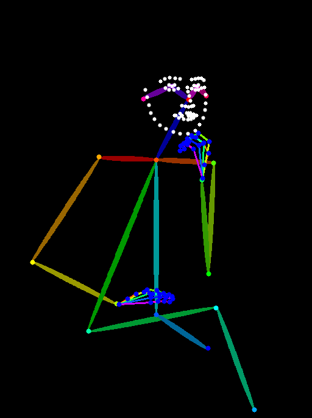
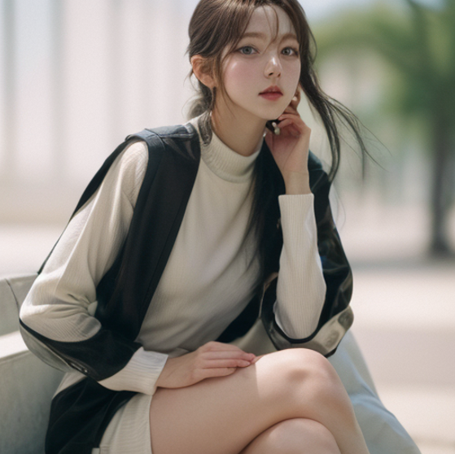
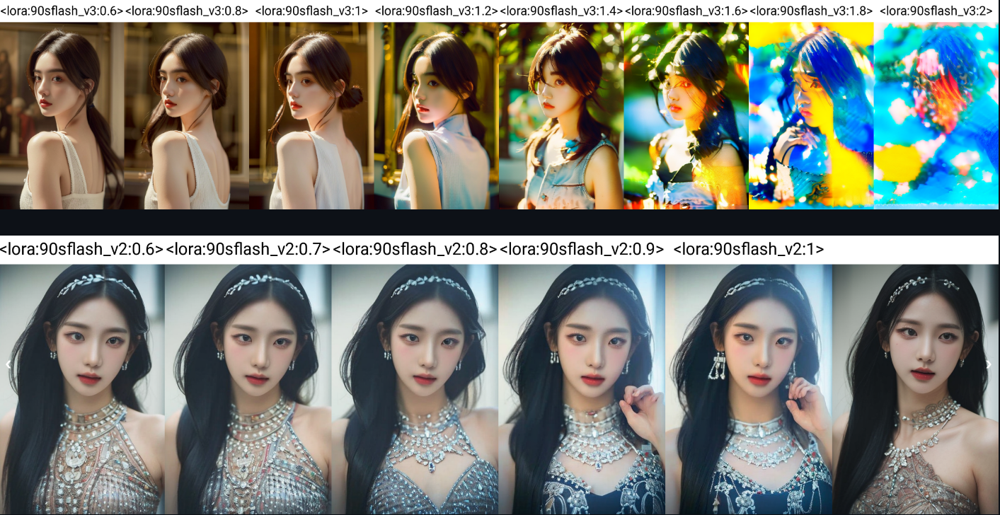
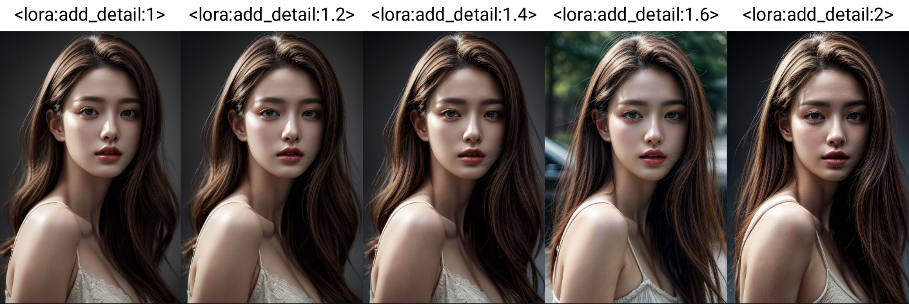
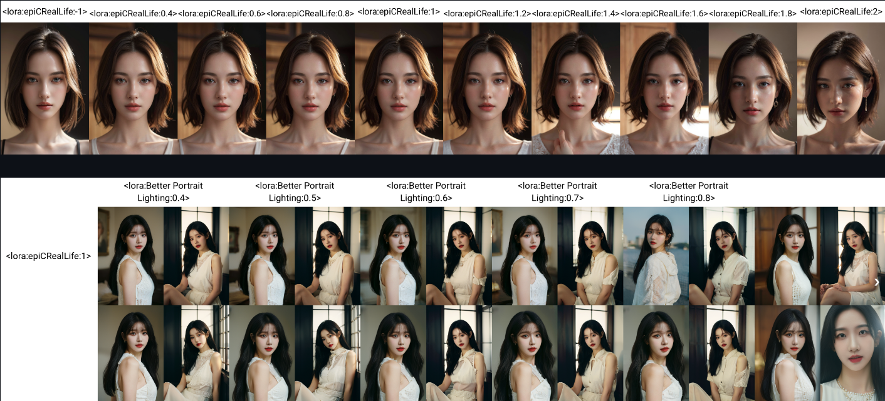
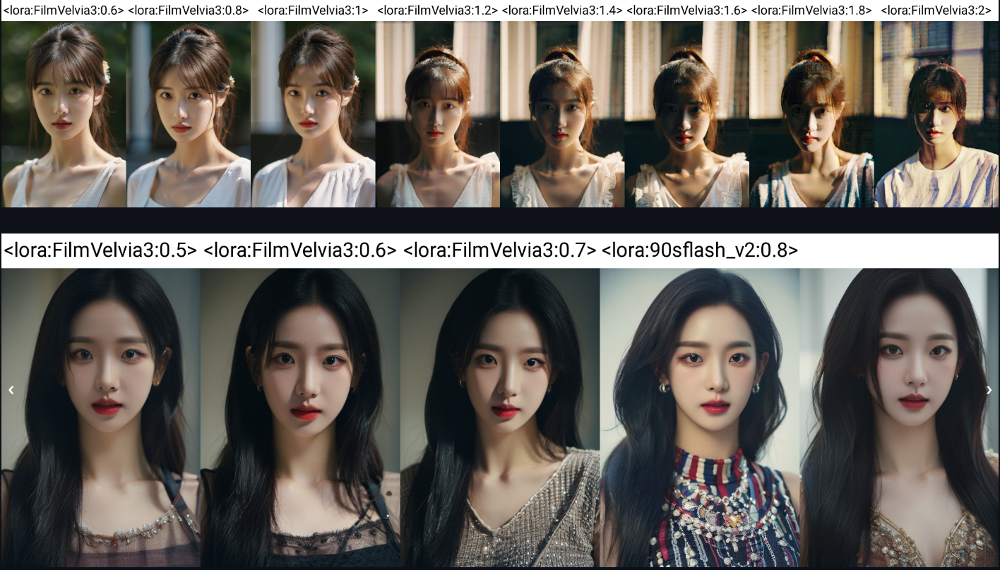

# -	Stable Diffusion 기반 사진 I2I 서비스 MVP 개발

참여자 : 박사무엘, 강동훈, 지주영, 남궁맑음, 정양섭, 김아진

---

**프로젝트 기간:** 2023.11 ~ 2023.12 (6주)

**프로젝트 Tool:** Flask, Gradio, Stable Diffusion web UI, Github, Notion, Discord

---

 

 

**Output**
 

- **장원영 (아이브)**

	
	
	
 	<figcaption align="center"></figcaption>

 

- **IU**

	
	
	
	<figcaption align="center"></figcaption>

 

- **카리나 (Aespa)**

	
	
	
	<figcaption align="center"></figcaption>

 

### ****프로젝트 개요****

- User 의 Image를 학습한 후, 개인화와 더불어 생성 Image의 포즈와 색감을 더한 AI 스튜디오 프로필 사진을 만드는 프로젝트
- Minimum Variable Product가 구동할 WEB page를 담당할 Gradio API 구축
- 개인화를 담당할 LoRA를 하는 training 구축
- Stable Diffusion Web UI API를 이용한  Module Code 구축
- 생성 Image quality 증진을 위한 Prompt 연구

### 프로젝트 배경

- SNS와 저연령츠에게 인기 많은 스튜디오 프로필 사진
- 스튜디오 프로필에 소요되는 많은 금전적 육체적 피로
- 이미 여타 기업들도 시작하고 있는 AI 생성 시장

 

### 프로젝트 기술 스택

- **Backend**
    
    
    
- **Frontend**
    
    Graido
    
- **Tools**
    
    Stable Diffusion Web UI A1111   
    
 

### 개발 인원

| 이름   | 담당 업무                                                                                                                                                                                                 |
|--------|-----------------------------------------------------------------------------------------------------------------------------------------------------------------------------------------------------------|
| 박사무엘 | - Base model code 구축   - Stable Diffusion을 활용한 model Module code 구축 - Image Concept에 맞는 Prompt Reasearch and Development 개선 |
| 강동훈 | - LoRA Reasearch   - LoRA training code 구현                                     |
| 지주영 | - Base Prompt 구축 및 Reasearch and Development                                     |
| 김아진 | - Preprocess 및 데이터 수집                                     |
| 정양섭 | - Web page를 담당할 Gradio API 구축   - API 를 연동할 Code 구축   - Git Maintance                                     |
| 남궁맑음 | - 두개의 온프레미스 Local server를 이용한 환경 구축   - Flask API를 구축                                     |

 

## 프로젝트 진행 과정

1. 유저의 이미지 10장을 통해 Easy-Photo의 train 후 user의 LoRA 생성한다.
2. 생성된 LoRA를 프롬프트에 추가한다
3. Generation Inference start
4. T2I로 이미지의 뼈대와 포즈 및 유저의 얼굴 생성한다.
5. user의 LoRA 와 손 등을 후보정 수행한다.
6. T2I의 output을 I2I로 처리하여 이미지의 tone-filter 를 denoise 미화작업을 수행한다.
7. user의 LoRA 와 손 등을 다시 한번 더 후보정 수행한다. (이미지가 denoise를 통해 변한 부분을 변동없게 하기 위해서)
8. I2I를 다시 한번더 진행, 하지만 이번에는 Denoise를 낮게 주고, 해상도를 만을 높이면서 detail up을 목적으로 upscale 진행한다.
9. 최종적인 이미지를 생성후, Graido로 전송한다.
10. Gradio를 통해 user에게 출력하여 보여줍니다.

 

 

### 프로젝트 담당 진행 과정

1. Stable Diffusion T2I, I2I, 그리고 Upscale을 위한 코드 구축
2. 추가적인 기능들을 담당할 Module 구현 
3. Generated Image quality를 위한 Prompt 및 여러 추가 LoRA 모델 연구

### 프로젝트 구현 내용

1. **T2I, I2I, Upscale**

 

1. **T2I** user의 얼굴 학습 user의 이미지를 받아 학습을 진행하여 LoRA를 만든뒤, 저희가 만든 Prompt를 기반으로 ControlNet 기법을 통해 생성의 마지막단에 Conditioning을 추가하여 Pose를 같이 구현합니다. 보정 Adetailer를 통해 보정할 부분을 Detection model; Yolov8 모델을 통해 얼굴과 손을 dection을 진행하고, 보정하는 부분 만을 Inpainting 기법을 통해 inpaint 할 부분에 전용 Prompt를 따로 주어, TextToImg 단계에서 같이 생성합니다.

 

2. **I2I** 미화 작업 T2I의 output img를 i2i단에서의 base img 기반을 두어 생성을 시도합니다. I2I 단계에서는 T2I와 다른 Prompt를 두어서 Img의 느낌과 색감을 다르게 생성하는것에 초점을 두고 생성합니다. 하지만 Denoise를 크게 주지 않는선에서만 생성을 시도합니다. 보정 T2I에서와 마찬가지로, Adetailer를 통해 같은 부위를 decting하고, 어그러지는 부위가 없도록 방지합니다.

 

3. **Upscale** 해상도 증가와 디테일 부분 캐치 I2I의 output img를 그대로 base 기반으로 두고, denoise를 아주 낮게 설정한다. 그리고 ControlNet의 tile_Resample preprocess 기법을 통해 다시 샘플링을 따르면서 해상도를 늘리는 작업을 수행합니다. Script 해상도를 올리 때 여러가지 기법들이 존재하지만, webUI 내의 script의 Ultrasharp-upscale 을 이용해 해상도를 올리면서 디테일한 부분들을 더 자연스럽게 생성하게끔 합니다.

 

2. **기능 Module**

- **Adetailer**
    + 생성되는 이미지의 오류들을 Inpaint 기능을 이용하여 후 보정하는 기능을 API를 통해 구현.
    + 아래의 2사진은 원작자의 Adetailer 작동예시 Image

 

- **ControlNet**
    + 아래와 같이 고른 사진의 pose estimation을 생성하는 Image에 Pose를 같이 생성되게끔 함

 

3. **Prompt 및 여러 추가 LoRA 모델 연구**

- 프로젝트 내의 다양한 생성을 위한 LoRA 선별 및 실험을 하였음

  

### 프로젝트 한계 및 개선 방안

**한계**

- 프로젝트의 시간이 부족하여 User 의 얼굴 학습하여 만드는 LoRA의 성능이 향상이 어려웠음
- 학습을 하는 구간이 생겨 오래 걸리는 한계가 존재 서비스를 위한 짧은 시간안에 생성하는것이 어려웠음.
- 프로젝트의 데이터 로써 연예인 얼굴을 사용하여 쓰다보니 학습 데이터의 화질에 따라 성능이 천차만별이였음.
- 자원이 부족함에 따른 베이스 모델 fine-tuning 못해봄

**개선 방안**

- 오래걸리는 서비스를 위한 로그인 기능 및 이메일에 User의 이미지를 보내는 기능
- Training time을 줄이는 code 개발
- 생성 image의 더 좋은 prompt 연구
- Dreambooth를 이용한 실사 베이스 모델 개발